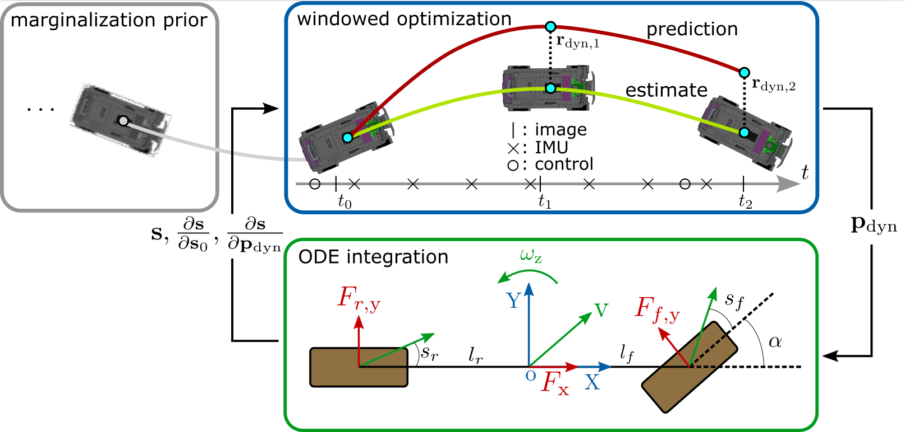

# ST-VIO: Online Calibration of a Single-Track Ground Vehicle Dynamics Model by Tight Fusion with Visual-Inertial Odometry
<p align="center">

</p>

This repository provides source code for ST-VIO accompanying the following publication:

*Haolong Li and Joerg Stueckler, "**Online Calibration of a Single-Track Ground Vehicle Dynamics Model by Tight Fusion with Visual-Inertial Odometry**"*  
*In **IEEE International Conference on Robotics and Automation (ICRA)
2024**, Yokohama, Japan, to appear*. Preprint: https://arxiv.org/abs/2309.11148

If you use the source code provided in this repository for your research, please cite the corresponding publication as:
```
@inproceedings{li2023_stvio,
  author      = {Haolong Li and Joerg Stueckler},
  title       = {Online Calibration of a Single-Track Ground Vehicle Dynamics Model by Tight Fusion with Visual-Inertial Odometry},
  booktitle   = {In Proc. of the IEEE International Conference on Robotics and Automation (ICRA)},
  year        = {2024},
  note        = {to appear, preprint at https://arxiv.org/abs/2309.11148},
  doi={}
}
```


## Installation 
Download [Basalt](https://github.com/VladyslavUsenko/basalt-mirror) and check out to commit cc6d896,
install libfmt-dev.
```
git clone --recursive https://gitlab.com/VladyslavUsenko/basalt.git
cd basalt
git checkout cc6d896
git submodule update --recursive
```
Install dependencies
```
sudo apt-get install libfmt-dev
```
Build basalt following the instructions in its repository.


* We build basalt with gcc-9, you can install the compliler:
  ```
  sudo apt-get install gcc-9 g++-9
  ```
  and set cmake flags e.g. with:
  ```
  cmake .. -DCMAKE_BUILD_TYPE=RelWithDebInfo -DCMAKE_C_COMPILER=/usr/bin/gcc-9 -DCMAKE_CXX_COMPILER=/usr/bin/g++-9
  ```

  If you encounter compile issues with picojson.h in Pangolin, you can fix it using the following patch (line 392):
  ```
  - (type_ == int64_type && (const_cast<value *>(this)->type_ = number_type, const_cast<value *>(this)->u_.number_ = u_.int64_),
  + (type_ == int64_type && (const_cast<value *>(this)->type_ = number_type, (const_cast<value *>(this)->u_.number_ = u_.int64_)),
  ```

In CMakeList.txt of st-vio set `Basalt_DIR` to the basalt source folder, e.g: 
```
 set(Basalt_DIR "$ENV{HOME}/basalt")
 set(EIGEN_ROOT "${Basalt_DIR}/thirdparty/basalt-headers/thirdparty/eigen")
```
Install the `stable` branch of [ACADO](https://github.com/acado/acado),
and source ACADO environment variables:
```
source ${ACADO_TOOLKIT_PATH}/acado_env.sh
```


Build ST-VIO:
```
git clone https://github.com/EmbodiedVision/st-vio.git
cd st-vio
mkdir build
cd build
cmake -DCMAKE_BUILD_TYPE=Release -DCMAKE_C_COMPILER=/usr/bin/gcc-9 -DCMAKE_CXX_COMPILER=/usr/bin/g++-9 ..
make -j8
```

# Run

```
./app_dynamics_vio --cam-calib ../config/t265_factory_calib_crawler.json \
    --config-path ../config/t265_example_vio_config.json \
    --save-trajectory tum \
    --dynvio-config-path ../config/dynvio_crawler_online_config.json \
    --dataset-path ${ROSBAG_URL} \
    --output-dir ${RESULT_PATH} \
    --start-time 0 \
    --end-time 0 \
    --show-gui 0 \
    --save-bavar 0 \
    --save-pred 1
```


## Data
You can download the rosbag datasets used for evaluation in the published paper from [KEEPER](https://keeper.mpdl.mpg.de/d/0a1b41d14c34426d8f48/).
The details of the dataset can be found in the corresponding README.md.
> **_NOTE:_** To reproduce the results in the paper, for sequences *_full set:
--start-time 0.1
--end-time 3,
for sequences *_varying set:
--start-time 0
--end-time 5.

Note: The data on Keeper has been updated by removing an erroneous image frame at the start of the outdoor_varying concrete1 sequence which causes small changes in the results of the outdoor_varying concrete sequences towards Table II (Average prediction RPE) of the published paper. See README.md of the dataset for further details.

## Evaluation
Install rpg_trajectory_evaluation in eval_tools folder and add eval_cfg.yaml in the result folder.
```
cd eval_tools
git clone https://github.com/uzh-rpg/rpg_trajectory_evaluation.git
cd ${RESULT_PATH}
echo -e "align_type: se3\nalign_num_frames: -1" > eval_cfg.yaml
```

Evaluate the tracking result:
```
python analyze_trajectory_single.py ${RESULT_PATH}
```
Evaluate the prediction result:
```
python analyze_pred_dyn.py ${RESULT_PATH}
```

## License
ST-VIO has been developed at the [Embodied Vision Group](https://ev.is.mpg.de) at the Max Planck Institute for Intelligent Systems, Germany. The open-source version is licensed under the [GNU General Public License v3 (GPLv3)](./LICENSE).

For commercial inquiries, please send email to [ev-license@tue.mpg.de](mailto:ev-license@tue.mpg.de).
